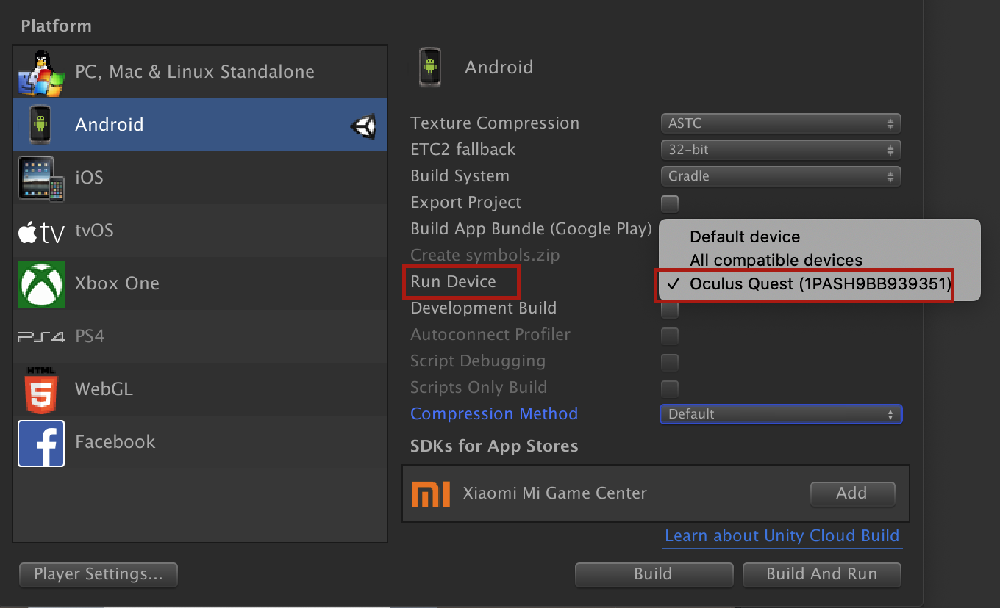

# Enable Device - Oculus

Testing your app on a real device prior to releasing it to users is an imperative step in software development lifecycle. This topic describes how to set up your Oculus device for testing and debugging your app on Oculus device.

Depending on the Oculus device, you can choose different ways to test your app. In general, connecting your device through USB is the basic and mandatory way to test your app on the Oculus device. In addition, you can optionally use Android Debug Bridge (ADB) to perform advanced-level testing and debugging activities for Android apps.

### Connect Device Via USB

You can run your app in the Oculus device to test its functionality, layout, and overall user experience. The Oculus device is connected to the computer over a USB cable. Prior to connecting the device and your computer, you need to set your device into developer mode.

1. Open the companion Oculus app on your phone and go to Settings.
2. From the list of paired Oculus devices, tap the device you want to set up, and tap More Settings > Developer Mode.
3. Slide the toggle to turn on the developer mode.
4. Connect the device with your computer by using a USB-C cable.
5. Put on the device, and when prompted for permission to allow the connected computer to access the device, click Allow.
6. To verify the connection, open any Unity project that can build, go to File > Build Settings.
7. From the Platform list, select Android, and click Switch Platform. If the target platform is already set to Android, skip to the next step.
8. In the Run Device list, you should be able to view the Oculus device.

9. Click Build And Run to run the app on the Oculus device.

The scene loads in the connected Oculus device.

### Enable Android Debug Bridge Debugging

Android Debug Bridge (ADB) is a command-line utility that lets you perform a variety of actions such as install and debug apps, copy files, or run several shell commands on the Oculus device. It is included with the Android SDK tools installation and located inside the /Android/SDK/platform-tools/ folder.

1. Connect device via USB.
2. If you’re developing on Windows, download the OEM USB driver. If you’re developing on macOS, skip to step 3 as you don’t need any additional USB drivers.
    1. Extract the oculus-adb-driver-2.0 zip file, go to the /oculus-go-adb-driver-2.0/usb_driver/ folder, and double-click the android_winusb.inf file.

3. Open Terminal on your computer and run the following command to check the connected device:

**adb devices**

Output:

<code>
 List of devices attached
 1PASH9BB939351	device
</code>

### Install APK via ADB

When you build an app in Unity, it creates a .apk file, which is an Android executable file. You can install the apk manually on your Oculus device for testing and debugging purposes by using ADB commands.

1. Open any Unity project that can build and go to File > Build Settings.
2. From the Platform list, select Android, and click Switch Platform. If the target platform is already set to Android, skip to the next step.
3. Click Build.
4. Open Terminal on your computer and run the following command to install the app: adb install -r <build_path>

Sample command:

adb install -r /Users/username/Unity-Sample-Projects/ballgame/playgame.apk

Output:

<code>
 Performing Streamed Install
 Success
</code>

5. Put on your Oculus device, go to Library > Unknown Sources and run your app.

### Additional documentation for using ADB

ADB is a versatile tool that lets you perform several debugging activities. There are a variety of adb commands that you can run on your Oculus device based on your requirement. For more information about learning ADB in detail and using its commands, go to Android Debug Bridge in the Android documentation.

##### Troubleshooting

* Computer is unable to detect the Oculus device.

    * There can be many reasons why your computer is unable to detect the Oculus device. To begin with:

    * Ensure that you have turned on the developer mode in the Oculus companion app on your mobile.

    * Check if the issue is caused due to a faulty USB cable. Connect the device by using a secondary USB cable. If you do not have the secondary USB cable, connect any other Android device to verify if the issue is with the USB cable.

    * Ensure that your computer has all the necessary permissions to access your Oculus device. Typically, when you connect your device with the computer over a USB cable, you see a prompt to permit your computer to access the device. By mistake, if you have denied permission, disconnect the USB cable, restart the device, and then connect the cable again. When prompted for permission, click Allow.

* Terminal returns an error: adb command not found.

    * Begin by verifying whether adb is correctly installed. Go to /Android/SDK/platform-tools/ folder and check for the adb tool. If the tool is missing, download the standalone Android SDK Platform-Tools package.

    * Check whether you’ve set the environment variables correctly.
    
    * You can run adb from the /Android/SDK/platform-tools/ folder by prefixing ./ to the adb command. For example, instead of adb devices, use ./adb devices.
    
If you have already set up your Oculus Rift for regular use, you are ready to begin Unity development.

While you build your app, Unity prompts you to provide location for the build, from where you can access the app for testing purposes. Considering you want to test your app, which is pending Oculus review, you must allow unknown sources on your device.

* Open the Oculus companion app.
* From the upper-right corner, click the gear icon.
* Go to Settings > General and slide the toggle to allow unknown sources. When prompted for confirmation, select Allow.
* Go to the location where you’ve saved the build and launch the executable.

<a href="https://developer.oculus.com/documentation/unity/book-unity-gsg/" target="_new">Source</a>