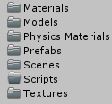
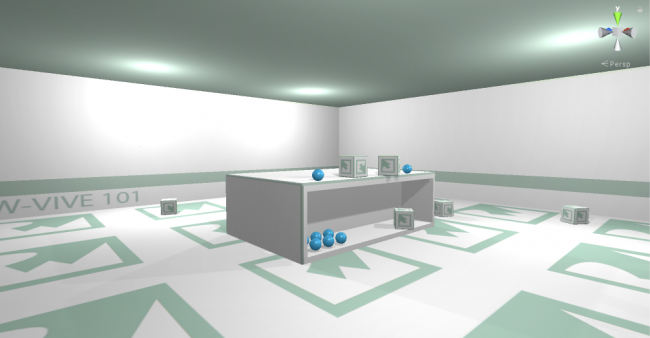

# Setup

## Getting Started

Before you dive into this tutorial, make sure you have the following:

1. A VR-ready Windows PC.
2. A copy of Unity 2018.3 or newer installed on your machine.
3. An HTC Vive or HTC Vive Pro with all of the hardware installed and software configured and updated.
4. Steam and SteamVR installed. See this guide, which walks you through hardware set up and provides links to download Steam and SteamVR.
5. Basic Unity knowledge: Introduction to Unity: Getting Started.
6. A basic understanding of scripting: Introduction To Unity Scripting.
7. An HTC Vive that’s powered on and connected.

Download the materials for the project using the Download Materials button at the top or bottom of this tutorial, unzip it somewhere and open the starter folder inside Unity. Look at the contents of RW in the Project window:

### AssetFolders

Each folder serves as home base for specific assets:

1. Materials: Materials used for the scene including the blue bouncy balls.
2. Models: All the models.
3. Physics Materials: Bouncy ball physics material.
4. Prefabs: Loose object prefabs.
5. Scenes: The game scene is in here.
6. Scripts: All the scripts.
7. Textures: The single texture shared by all objects in the scene.
8. Open the Game scene. Look at the scene view and click play to try the game:

### FirstSceneView

At the moment, not much is happening because there’s no VR rig in the scene yet. You’ll need to add SteamVR to the project to connect the Vive to Unity.

#### Setting Up SteamVR

The SteamVR SDK is an official library made by Valve that makes it easier to develop for all major VR headsets. It’s currently free on the Asset Store and supports the Oculus Rift and the HTC Vive to name a few.

1. Open the Asset Store by selecting Window > General > Asset Store in the top bar

2. Once the store loads, type SteamVR in the search field at the top and click Enter. Scroll down a bit to see a selection of assets. Click SteamVR Plugin to open its store page

3. Click Download and give it a moment. Once it’s done, click Import to open the package import dialog. Click Import at the bottom-right corner of this window to import the package

#### ImportPackage

Note: At the end of the import, you may see the following message depending on your version of Unity:

ApiUpdate

1. Click the button that reads I Made a Backup to let the editor update and recompile the scripts.

#### SteamVrSettings

This is part of the SteamVR plugin; it shows which editor settings you can improve to maximize performance and compatibility.

When you open a fresh project and import SteamVR, you’ll see quite a few entries. Since the starter project is already well optimized, the only recommendation here is to disable the resolution dialog.

Click Accept All to perform all of the recommended changes. Close the Asset Store and switch back to the Scene view. You’ll now have a new folder named SteamVR in your Project window

Open the SteamVR folder and look at the folders inside. You’ll add some essential VR GameObjects from the Prefabs folder to the scene next.

#### SteamVrPrefabsFolder

Select both [CameraRig] and [SteamVR] and drag them to the Hierarchy:

#### DragVRPrefabs

[SteamVR] has a Steam VR_Render component attached that handles the rendering of all VR cameras.

[CameraRig] is more interesting because it controls the Vive’s headset and controllers. Select [CameraRig] and set its Position to (X:0, Y:0, Z:-1.1) in the Inspector to slide the whole rig just behind the table.

Delete the Main Camera from the Hierarchy because it’ll interfere with [CameraRig] and its embedded camera.

Put your HMD in reach, turn on the controllers and start the scene. Take both controllers and swing them around a bit. You’ll notice that you see the virtual controllers waving around in the Scene view:

#### ControllerMoveScene

Once the SteamVR plugin detects the controllers, it creates these virtual versions. The controllers are mapped to the two Controller children of [CameraRig]:

Now, while still running the scene, select Camera in the Hierarchy and carefully pick up your head-mounted display by the top strap. Move and rotate it a bit and watch the Scene view:

#### HeadMove

Camera is linked to the head-mounted display and precisely tracks every real-life movement and rotation.

Now, put the head-mounted display on your head, grab the controllers and look and walk around a bit to get a feel for the room.

If you try interacting with the objects, you’ll be disappointed because nothing happens. To add functionality beyond movement tracking, you need to do some scripting.

<a href="https://www.raywenderlich.com/9189-htc-vive-tutorial-for-unity#toc-anchor-002" target="_new">Source</a>