# What are AR Markers

  <button class="tablinks" onclick="openTab(event, 'Overview')">Overview</button>
<button class="tablinks" onclick="openTab(event, 'Frame')">Frame Markers</button>
<button class="tablinks" onclick="openTab(event, 'Image')">Image/NFT Markers</button>
<button class="tablinks" onclick="openTab(event, 'GPS')">GPS Markers</button>
<button class="tablinks" onclick="openTab(event, 'Object')">Object Markers</button>
<button class="tablinks" onclick="openTab(event, 'MarkerLess')">Marker Less</button>
<button class="tablinks" onclick="openTab(event, 'Multi')">Multi Markers</button>
<button class="tablinks" onclick="openTab(event, 'NonVisual')">Non-Visual Markers</button>

People talking about augmented reality often mention the words "tracking" and "markers". But what are augmented reality markers? In this article, we want to give you a short explanation and a few examples of existing markers.

In short: Augmented reality markers or short AR-markers are visual cues which trigger the display of the virtual information.  Markers are normal images or small objects which are trained beforehand so that they can be recognized later in the camera stream.  After a marker is recognized, its position, scale, and rotation are derived from visual cues and transferred to the virtual information. At this point let us give you a few examples of the most common markers.

<table>
<tr>
<td></td>
<td>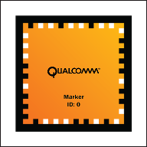</td>
<td>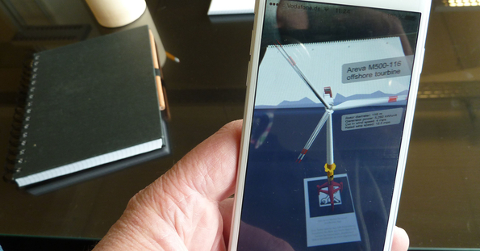</td>
</tr>
</table>

Real-time recognition of rectangles in pictures has been perfected over the years. Even if they rotated or skewed. That’s why it’s no surprise that the first marker is a border marker. A Border marker is usually a 2D-image which is printed on a piece of paper or another smooth surface. These markers are square and got a significant black ( sometimes white ) border. During the tracking phase, the system searches for a black rectangle. Only if it found one it examines the interior of the border to determine the real marker. Depending on how the border ís skewed the system can extract the position and rotation of the marker in relation to the camera.

<table>
<tr>
<td> Initial Image</td>
<td>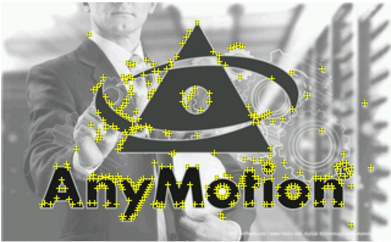 Natural Image</td>
<td>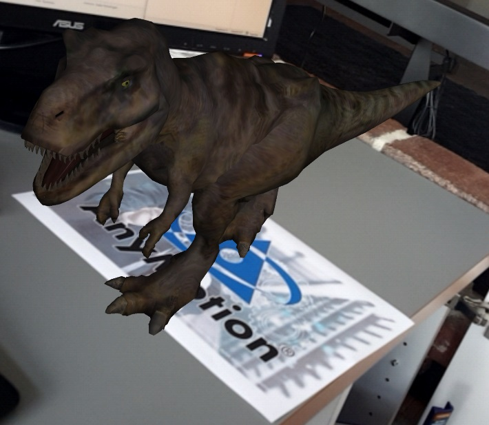 In action</td>
</tr>
</table>

Known under a few names we think NFT or natural feature Tracking Marker is the most appropriate name. NFT markers are the next logical step to framemarkers. NFT markers are images too but you don’t need the black border anymore. Instead, you extract so-called natural features from any picture you like. The problem is to determine “good” natural features and up to this point, it is much more trial and error than when using a frame marker. Every AR-frameworks has his own little secrets in this regard and quality and stability varies greatly from framework to framework.

<table>
<tr>
<td>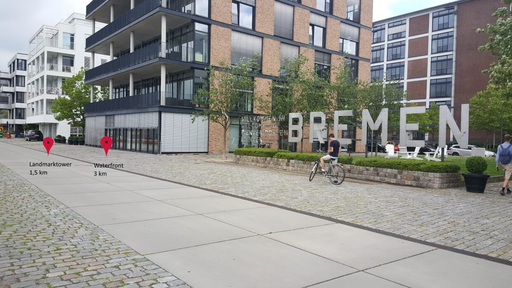 POI</td>
<td>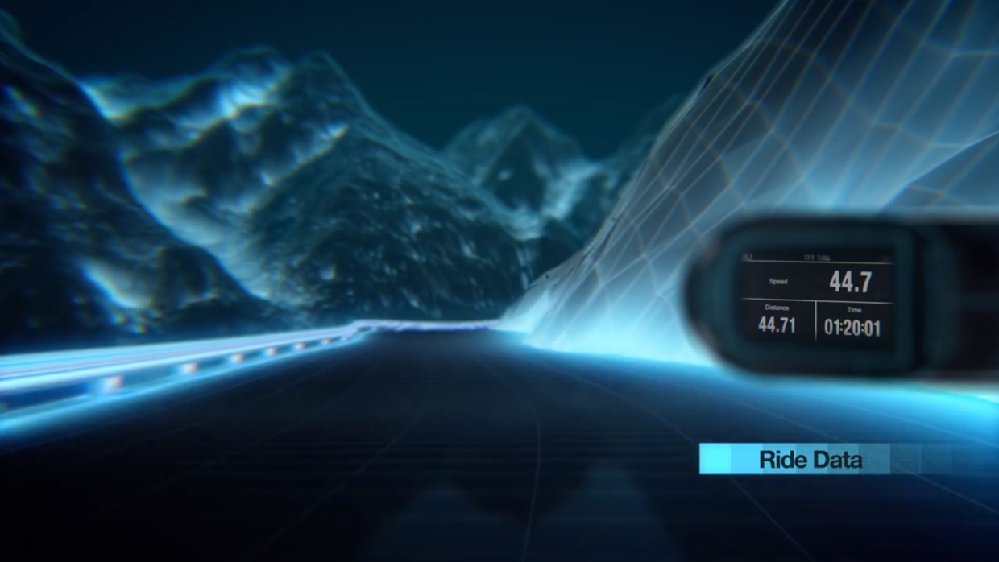 Web Video</td>
<td>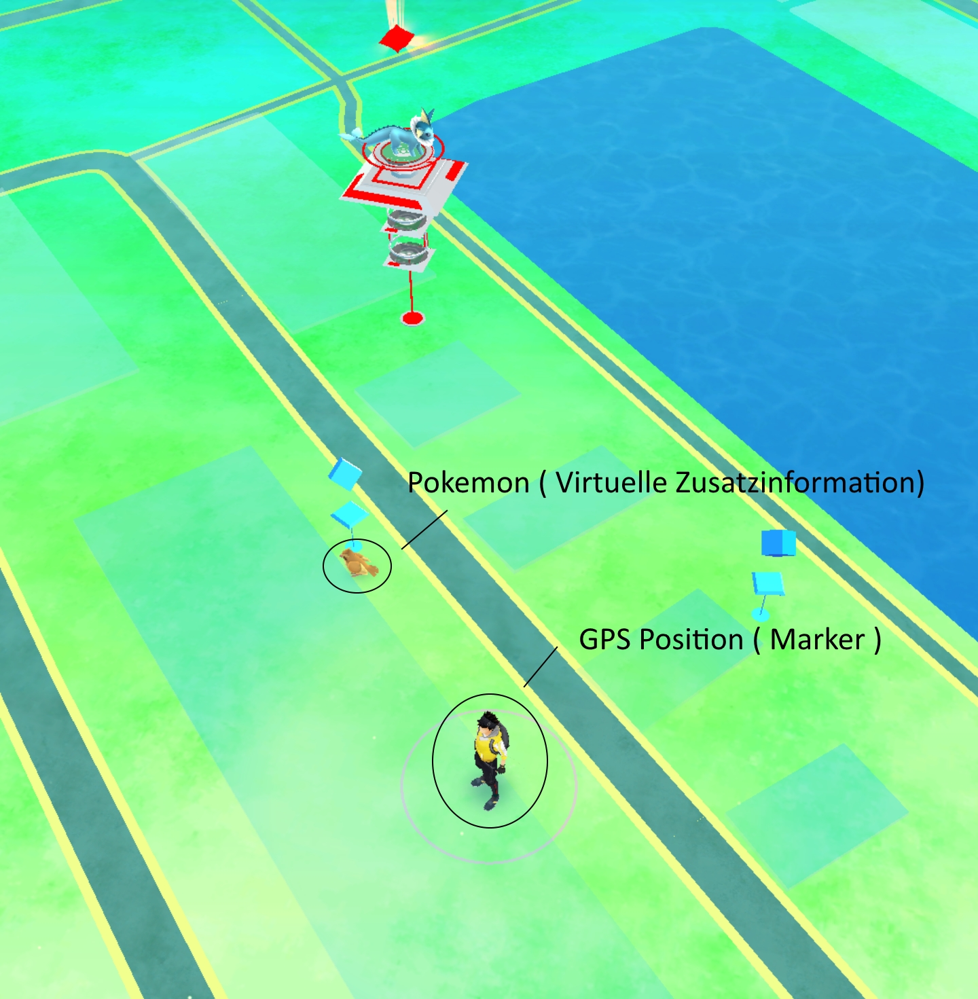 Pokemon</td>
</tr>
</table>

Using one’s gps position as a marker would be the first idea most people have. You could give objects, for example, a model of a building , it’s own gps coordinate and display it relative to your position. The reason why this is hardly done is the inaccuracy of this method. Depending on the gps hardware objects can appear up to 5 meters from their designated positions. Despite this shortcoming, there are a few applications which use gps markers because they don’t need high accuracy.  On example is an app which shows you the approximate direction of pois ( points of interest ). Another example is the computation of your current speed based on your gps coordinates over a certain time.

Some people would mention the map of the popular game Pokemon Go at this point. But although we got a gps marker and virtual additional information, it is disputable if this is really AR since the “reality” part of “augmented reality” is missing. Both the gps marker and the additional information are displayed on the virtual google map. If anything else this would qualify as augmented virtuality.

Advancement in hard- and software lead to new approaches in this area but in most cases, developers combine gps marker with some other method.

<table>
<tr>
<td>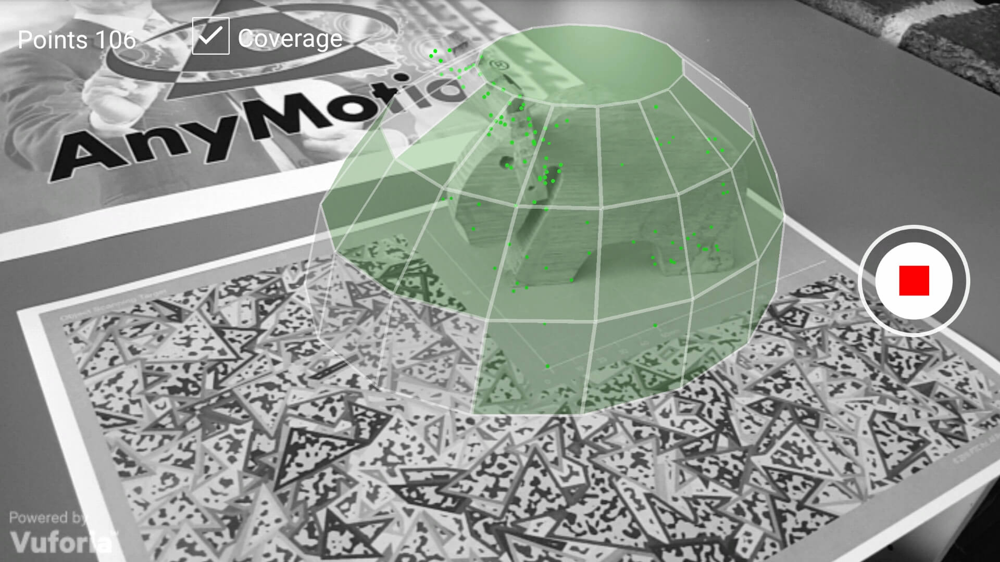</td>
<td>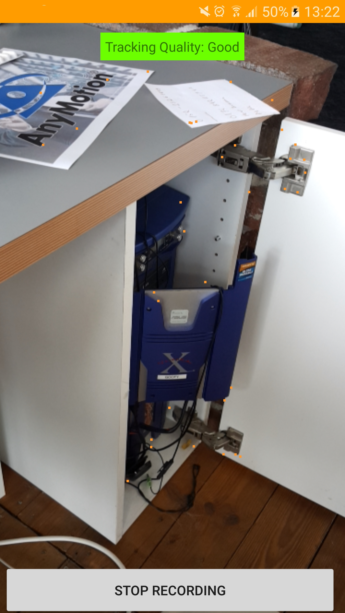</td>
<td>&nbsp;</td>
</tr>
</table>

Up until this point, we only had 2D-Markers and one based on gps information. But advancement in technology allows most mobile devices to solve the so-called SLAM (simultaneous localization and mapping) Problem in an efficient way. In this problem you extract information from your surroundings, or in this case your camera, in real-time and use this information to place a virtual object in it. Some premium frameworks offer the use of small objects as 3D-Markers. In a first step, the object gets analyzed and a point cloud is extracted. During the tracking phase, you extract point clouds from your camera input and try to match it to the cloud you have.
The main advantage is obvious. Viewing angle doesn’t matter anymore to recognize the marker.

<table>
<tr>
<td>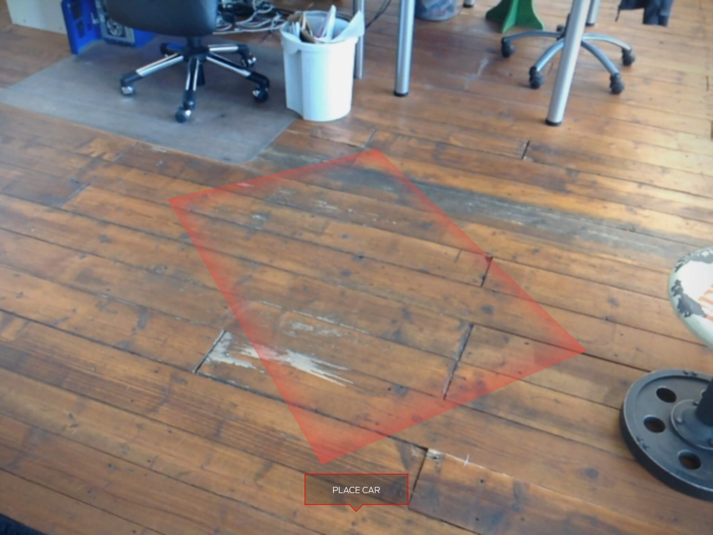</td>
<td>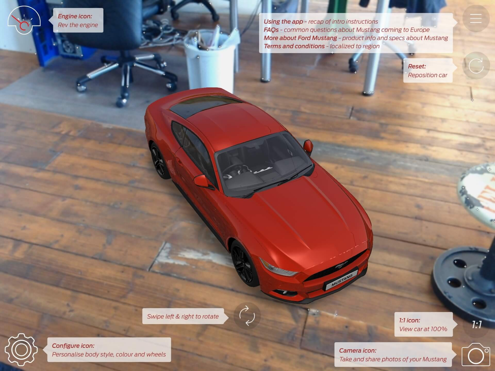</td>
<td>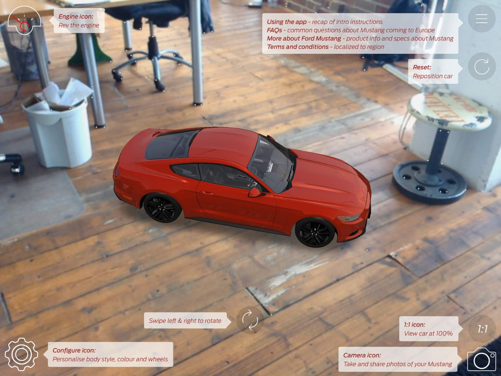</td>
</tr>
</table>

The name might be a bit confusing. This technique might be best known from frameworks like kudan or google tango. First you manually position an object in your view. Then it seems to be locked in place. But the system doesn’t solely depend on the sensors to keep the object in place. Although enormous advancements in the accuracy were made it still isn’t enough. It is more likely that sensor information are combined with solving the SLAM problem. When you place the object the hololens is extracting feature points from behind and around the object and use this information in conjunction with the sensor information to adjust the position of the object. So placing objects on a ground with many features should work better than placing it on a white piece of paper.

Be aware: Not everyone does define “markerless” this way.

<table>
<tr>
<td>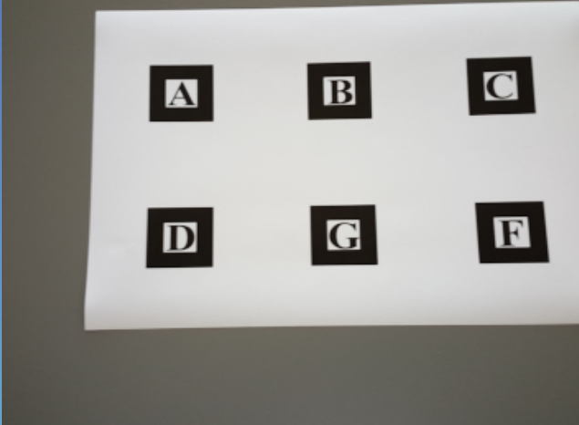</td>
<td>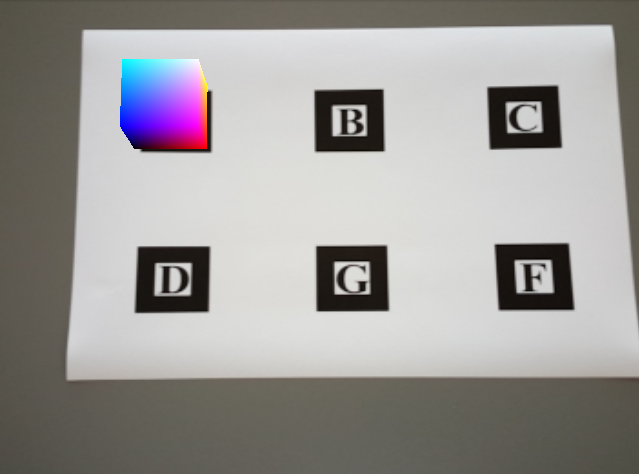</td>
<td>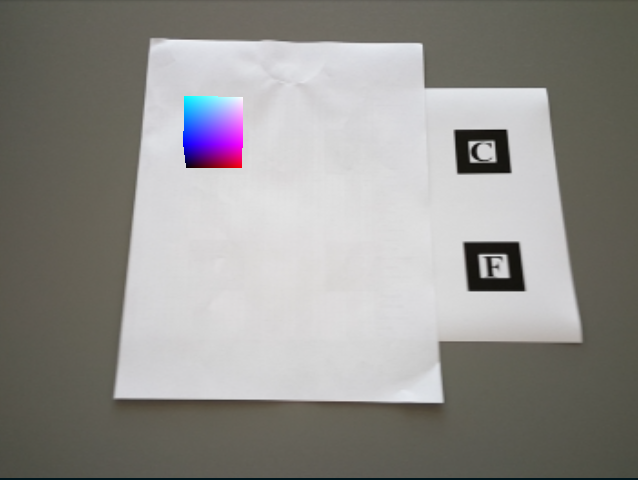</td>
</tr>
</table>

Multimarkers are a group of several single markers which have a predefined relation to each other. It was the first attempt to widen the field of view of a user. Only one marker out of the group needed to be completely visible to project the virtual information.

In most of the cases you talk about "visual" markers but there are other possibilities. We already mentioned GPS markers. Here are four other more or less common non-visual markers.

<ol>
<li>Activation marker. If you activate your camera app on your mobile phone you often see additional information on the upper and lower side of your picture. In most cases your current settings for your camera. Since this is a virtual information which is projected into your live camera feed this is augmented reality by definition. Your marker is replaced by "activation" of your camera-app.</li>
<li>The second example is RFID Tags. They are used for short distance wireless communication. You might know them from contact-free payment methods. You got some tags and an antenna. When the antenna gets close enough to a tag there is some communication between them. The same method can be used to trigger local based virtual information to be shown in certain spots.</li>
<li>You. Yes, that’s right. Long before technology caught up to the hype people used to insert additional information into live streamings. For example: A commentator at a soccer game drew running paths of players in a replay or circle specific players to point them out. This was also AR.</li>
<li>The last example is speech commands. This method is more suited for AR-glasses than mobile devices. You can just order your device to display certain information in your view. Your current position for example.</li>
</ol>

<a href="https://anymotion.com/en/wissensgrundlagen/augmented-reality-marker#:~:text=Marker%20%E2%80%93%20Augmented%20Reality&text=In%20short%3A%20Augmented%20reality%20markers,later%20in%20the%20camera%20stream." target="_new"><em>Reference</em></a>