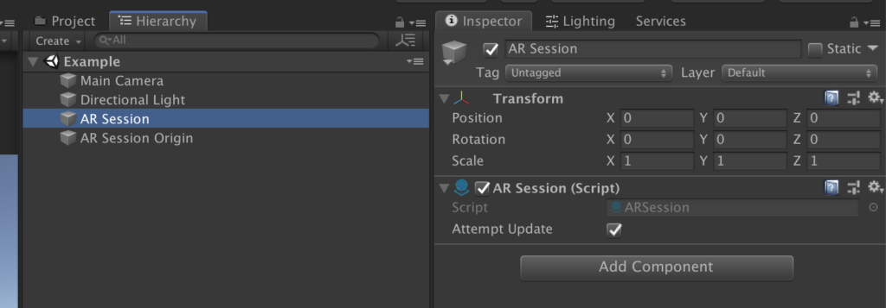
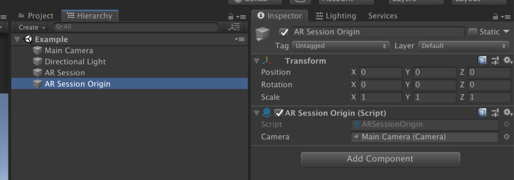
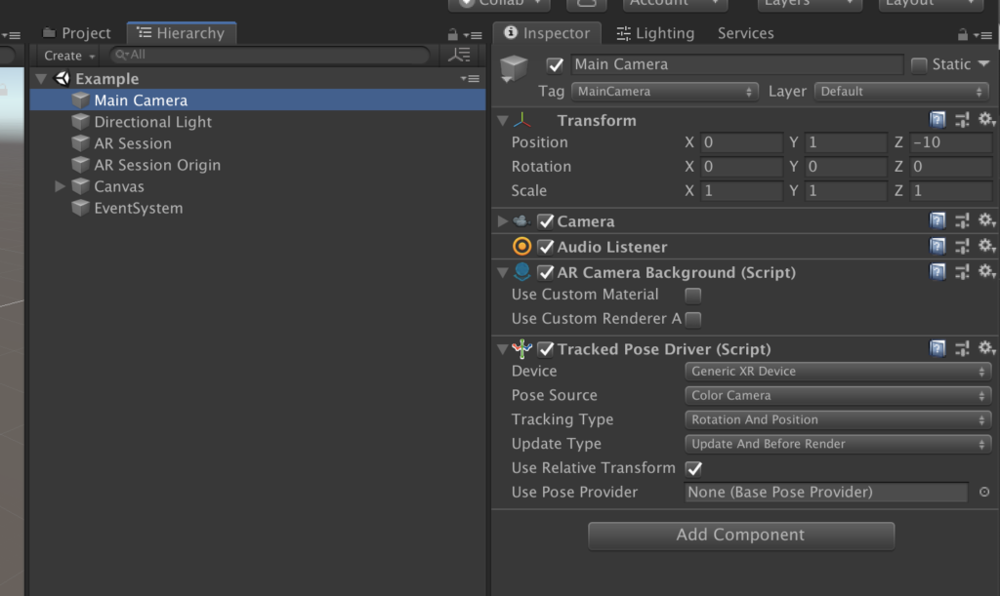
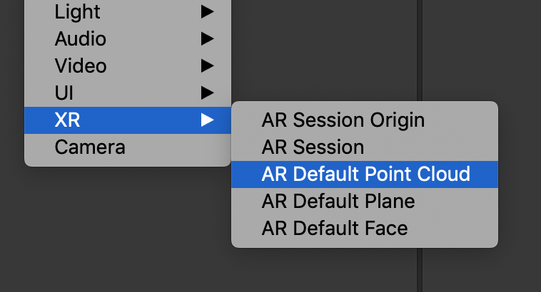
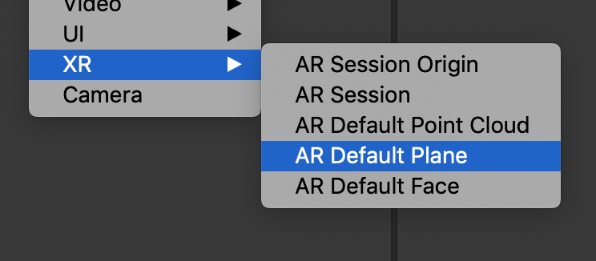
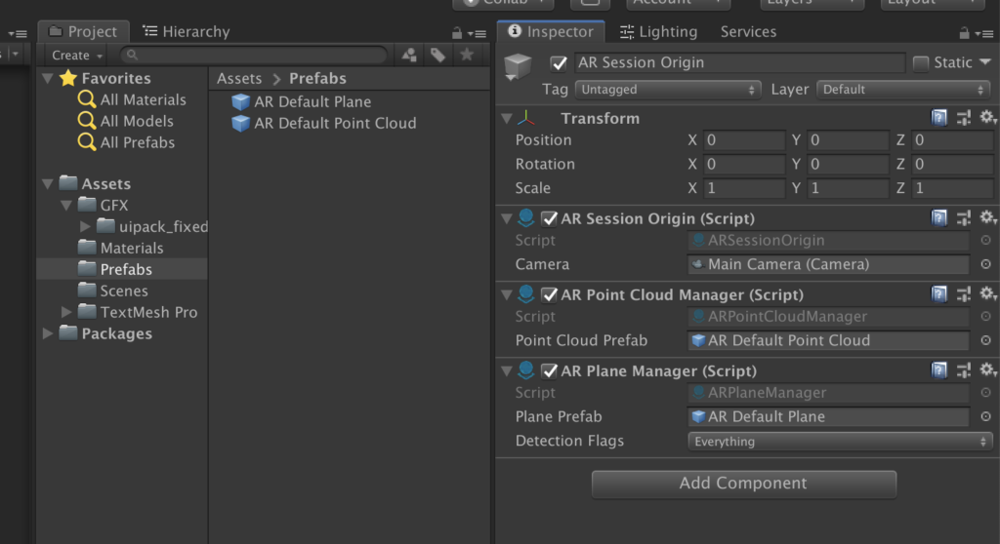

# Marker and Object

With these, we will have new components available in Unity editor.
Now we will need to configure our Scene to work with AR.

1. We need AR Session component placed on Scene.



2. We need AR Session Origin somewhere on Scene as well.



3. Add device camera feed to our in-game camera.



If you want to see what surfaces are detected by the device, we can also use Point Cloud to display particles on them.



Unity can also generate a surface mesh by using AR Plane [name].



You should make prefabs from both AR Point Cloud and AR Plane.
Now we need to attach a few more components to our AR Session Origin to use point cloud and surface mesh.



### Build
Make a build and check it out.

### Add Asset
Our next step will be to place and move a virtual object around in real life.
Next step will be to create a script that will place and move our virtual object. It is very similar to what we would have to do if you would like to do it only in a game.

There is just one difference. If you would like to move objects around in a game, we would have to use Physics raycasting. In the AR world, we need to do the same thing, but we are using ARRaycastManager to make those raycasts!

So this is a little example of placing and moving our object.

```csharp
using System.Collections;
using System.Collections.Generic;
using System.Linq;
using UnityEngine;
using UnityEngine.XR.ARFoundation;

/// <summary>
/// This is class responsible for moving game object around in real world.
/// </summary>
public class ARObjectPlacer : MonoBehaviour
{
    // Reference to object prefab
    [SerializeField]
    private GameObject arPrefab;

    // Reference to an instance of the object that will be moved.
    private GameObject arInstance;

    // Reference to Raycast Manager used to make raycasts to detect surfaces.
    private ARRaycastManager arRaycaster;

    // Flag if an object was placed or it should be moved
    private bool objectPlaced = false;

    /// <summary>
    /// Unity method called in before first frame.
    /// </summary>
    void Start()
    {
        // Get reference to AR Raycast Manager within this game object
        arRaycaster = GetComponent<ARRaycastManager>();

        // Create instance of our object and hide it until it won't be placed
        arInstance = Instantiate(arPrefab);
        arInstance.gameObject.SetActive(false);
    }

    /// <summary>
    /// Unity method called every frame.
    /// </summary>
    void Update()
    {
        // If instance is placed then skip update.
        if (objectPlaced)
            return;

        // Make a list of AR hits
        List<ARRaycastHit> hits = new List<ARRaycastHit>();

        // Center point of screen with 4 units of depth what will be used to make raycast
        var screenPoint = new Vector3(Screen.width / 2.0f, Screen.height / 2.0f, 4);

        // Trying to find a sufrace in world.
        if (arRaycaster.Raycast(screenPoint, hits))
        {
            // If we did hit something then we should place the instance in that point in space.

            // Order hits to find closest one.
            hits.OrderBy(h => h.distance);
            var pose = hits[0].pose;

            // Activate instance and move it to position on detected surface
            arInstance.gameObject.SetActive(true);
            arInstance.transform.position = pose.position;
            arInstance.transform.up = pose.up;
        }
        else
        {
            // If we didn't hit anything than we should hide instance
            arInstance.gameObject.SetActive(false);
        }
    }

    /// <summary>
    /// Method used to disable object movement, called by Place Button.
    /// </summary>
    public void PlacingFinished()
    {
        objectPlaced = true;
    }

    /// <summary>
    /// Method used to enable object movement, called by Move Button.
    /// </summary>
    public void PlacingBegin()
    {
        objectPlaced = false;
    }
}
```

1. Create a GameObject in the Hierarchy
2. Add the AR RayCast Manager
3. Drag the Script onto the Object
4. Add the Prefab to be displayed.